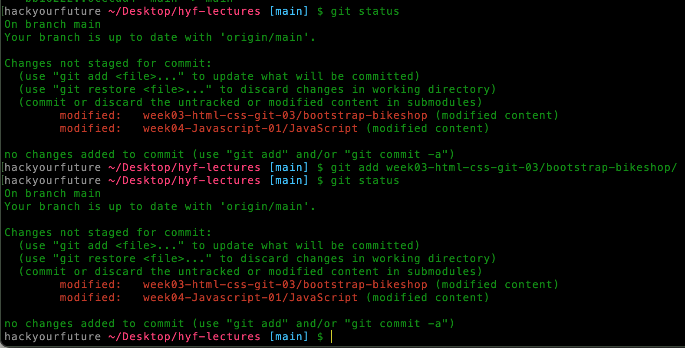
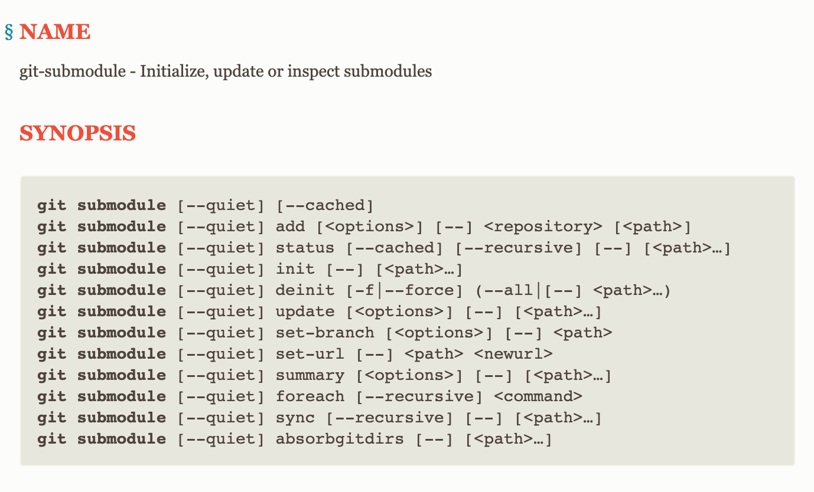

# Week-02 Q&A Session

## GIT Questions

1. I have created a local repository on my pc but I forgot that there was already a local repository created before inside it. After adding, committing and pushing my parent local repository to remote repository I got this:

I tried `git add week03-html-css-git-03/bootstrap-bikeshop/` and after `git status` but nothing changed.

I searched on Google and find this:

[git-submodule](https://git-scm.com/docs/git-submodule)

But it is too complicated for me. Could you give us a brief and easier explanation about `Git Submodule Concept`?
